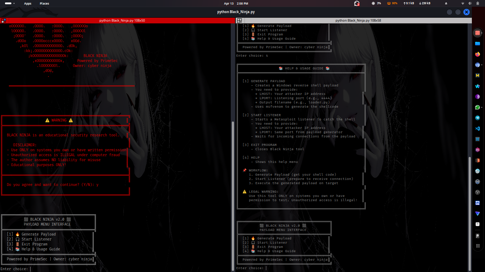

# Black_Ninja 
**Powered by the PrimeSec**  
Developed by **Cyber Ninja**

Black_Ninja is an advanced **educational cybersecurity research tool** designed to help students, analysts, and penetration testing enthusiasts understand how modern **payload workflows, detection patterns, automation systems, and listener frameworks** operate inside a controlled environment.

Although Black_Ninja is built with modern techniques and real automation structures, its primary purpose is **education**, **research**, and **demonstration** inside safe labs — especially for those following Cyber Ninja Tz on YouTube.

---

## 🧠 About Black_Ninja  
Modern antivirus engines rely on behavioral signatures, static analysis, and heuristic detection.  
Understanding how these systems work — and how adversaries structure payload automation — is essential for:

- Red team students  
- Blue team analysts  
- Malware research learners  
- Cybersecurity hobbyists  
- Detection engineering trainees  

Black_Ninja provides a clear, structured workflow that simulates the process behind:

- Organizing payload templates  
- Automating build processes  
- Structuring listener handlers  
- Demonstrating detection-triggering patterns  
- Understanding how AV engines react to certain code structures  

All in a safe, controlled, **educational** environment.

---

## ⚙️ Features
- **Payload Template Builder**  
  Demonstrates how automation frameworks prepare payload templates.
- **Listener Setup Workflow**  
  Shows how handler automation is structured.
- **Menu-Driven Interface**  
  Clean, fast, and easy-to-navigate CLI system.
- **Python-Based Automation**  
  Works on Linux, macOS, and Windows.

---

## 📥 Installation

Clone the repository:

```bash
git clone https://github.com/CyberNinja-Tz/Black_Ninja
cd Black_Ninja
```

Run Black_Ninja:

```bash
python Black_Ninja.py
```

---

## 🖥 Screenshots



---

## 📦 Converting Black_Ninja into a Windows EXE  

To compile Black_Ninja into an executable on Windows:

### Install PyInstaller:

```powershell
pip install pyinstaller
```

### Build the EXE:

```powershell
pyinstaller -F file_name.py --noconsole
```

Your executable will be created in:

```
dist/file_name.exe
```

Educational cybersecurity tools sometimes trigger **false positives** because security engines flag general automation behaviors — this is normal in the industry.

---

## 🧪 Recommended Lab Setup  
Black_Ninja is designed to be used inside:

- Virtual machines  
- Home labs  
- Cyber ranges  
- Controlled educational environments  
- Metasploit practice labs  

This ensures:
- user safety  
- system safety  
- accurate educational results  
- no interference with production environments  

---

## 🧱 Project Structure  

```
AVFIRE/
├── Black_Ninja.py          # Main Tool (PrimeSec)
├── README.md          # Full documentation
├── LICENSE            # Optional open-source license
└── screenshots/
      └── Screenshot From 2026-04-13 14-08-05.png.png
```

---

## 👨‍💻 Author  
**Cyber_Ninja**  
Cybersecurity Researcher & Cyber Security Mentor

Follow Me on Youtube Series for deep educational content.

---

## 📜 Legal Notice  
Black_Ninja is strictly for **educational and research purposes** in controlled environments.  
Use responsibly and ethically.

---

## ⭐ Support  
If you found Black_Ninja useful for your learning journey, consider starring ⭐ the project on GitHub.
